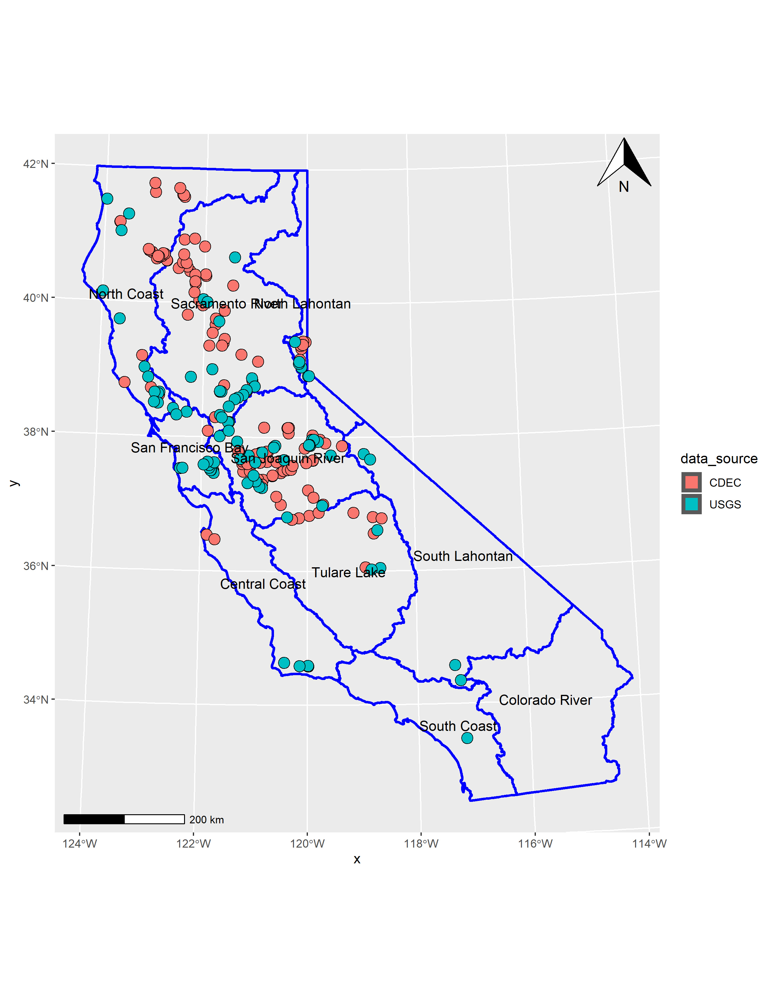

```{r setup, include=FALSE}
knitr::opts_chunk$set(echo = FALSE)
knitr::opts_chunk$set(message = FALSE)
knitr::opts_chunk$set(warning = FALSE)

# load packages but suppress startup info to make page look pretty
suppressPackageStartupMessages({
  library(tidyverse);
  library(sf);
  library(leaflet);
  library(here);
  library(mapview);
  library(here);
  library(lubridate);
  library(knitr)
})

```

## Title: *Classifying California streams for cold-water conservation*

## Authors: ***Ann Willis**, Ryan Peek, Steven Sadro?, Andrew Rypel?, Alexander Forrest?*

## Project Overview

This code was developed to analyze the thermal regimes of CA streams to
classify them with respect to their overall temperature (e.g., warm, cool, cold) 
and stability (i.e. cold-stable or cold-variable). The results of this analysis is 
to identify systems that should be targeted for long-term conservation. 
The code is outlined so that each section reflects major chunks of analysis.

### Libraries

Libraries required for this project: 

```{r libs, eval=FALSE, echo=TRUE}

library(dataRetrieval) #retrieving data from USGS
library(sharpshootR) # retrieving data from CDEC
library(tidyverse) #This library includes packages like ggplot2, dplyr, and tidyr
library(lubridate) #Tools that make working with dates and times easier
library(mosaic) #Fit the sine model to the temperature data
library(trend) #Performs the Mann-Kendall trend test
library(purrr) # functions that allow iteration/looping
library(sf) #This helps makes the map
library(mapview) #This helps make the map, too
library(here) # for path standardization
```

## Data Assembly 

Data sources for this study will be observed water temperature data from USGS and CDEC databases. In this chunk, we'll automatically query data from those databases, specifically targeting stations that have temperature data. Data will be reviewed to identify bad data points, data gaps, and length of record. Sites with sufficient data (criteria to be determined, but probably based on length of data record) will then be transformed into daily mean temperature and plotted. Jones and Schmidt (2018) is likely source for establishing minimum record length.

### Select and Map Distribution of Sites 

 > **Code: `01_filter_out_gages`**
 
Gages were selected and filtered to a final dataset. These data were visualized on an interactive map.

```{r sitemap, eval=T}

load(paste0(here::here(), "/data/cdec_usgs_final_selected_no_dups.rda"))

mapview(CDEC_final_no_duplicates, col.regions = "magenta", layer.name="CDEC")+
  mapview(USGS_final, col.regions = "turquoise", layer.name="USGS")

```

 > **`02_mapping_final_gages`**

Gages were cleaned and filtered to identify potential candidate sites. These gages were mapped.




### Download CDEC Data

 > **`03_get_cdec_metadata`**

CDEC data was filtered to only gages with >8 years of data, and these data were downloaded using the `sharpshootR` package.

```{r tst, echo=FALSE, message=TRUE, warning=TRUE, out.width="80%"}

include_graphics(path = paste0(here::here(),"/output/figures/cdec_gages_year_ranges_w_8yearsplus_by_interval.png"))

```


### Download USGS Data

 > **`04_get_usgs_metadata`**
 
This is a placeholder section for the code we'll develop to process the USGS data. The broad objectives are the same as for the CDEC data - we only want gages with >8 years of data.


### Data processing

 > **`05_data_prep_for_modeling`**
 
 This is a placeholder section for the code we'll develop to wrangle the data into its pre-modeling form. The output will a single water year of average daily data. Water day 1 = Oct 1; water day 365 = Sept 30

## Temperature modeling

 > **`06_temperature_modeling`**

Annual temperature patterns will be modeled using the sine function applied in Cluis (1972) and Caissie et al. (2001); a similar model was determined in Ward (1963). This model can be written using the mosaic package; I already have some code developed for internal data.

The model will be fit to a single water year of daily average data. Temperature data will be binned by records that represent (based on findings from Jones and Schmidt (2018):

 1. 8-12 years (the period of record necessary for reasonably accurate minimum temperature metrics)
 2. 12-16 years (12 years is the minimum time required for reasonable accuracy for all metrics)
 3. 16+ years (16 years is the record length required for high accuracy of maximum temperature metrics)

We will want to indicate which bin each model falls in. Relevant papers include Maheu et al. (2016), Jones and Schmidt (2018), Daigle et al. (2019), and possibly Ptak et al. (2019).

### Calculate Metrics

> **`07_thermal_regime_metrics`**

**Need to calculate:**

 - Calculate mean annual temperature, 
 - max annual temperature
 - day of max annual temperature
 
 Depending on how straight-forward this code is, we might just include it in our temperature modeling code as final output.

## Thermal regime classification

> **`08_thermal_regime_classification`**

Once temperature models are developed for each stream and metrics for each model quantified, streams are then classified and we interpret the output. See Maheu et al. (2016) for classification methods.

**Test Code**

```{r}

# Test code with dummy data to replicate MK results from Meals et al. (2011), example 2

MK_test <- read.csv("data/MK_test.csv")
TP <- MK_test$TP_mg.L
mk.test(TP, continuity = TRUE)
```

### Trend Test

Select streams with a stable mean annual temperature using the Mann-Kendall trend test. The Mann-Kendall trend test is a non-parametric statistical test to select thermal regimes with stable annual mean temperatures (i.e., sites minimally impacted by anthropogenic operations like flow regulation or diversions). This test was used in Maheu et al. (2016) to eliminate sites with anthropogenic influences. But because we're looking at all sites, we may not include this step in our analysis. It may be more informative if we apply this classification approach to historic and currently utilized habitat by thermally sensitive species. The trend test could indicate whether the historic and current habitat both had stable annual average temperatures, or not.


